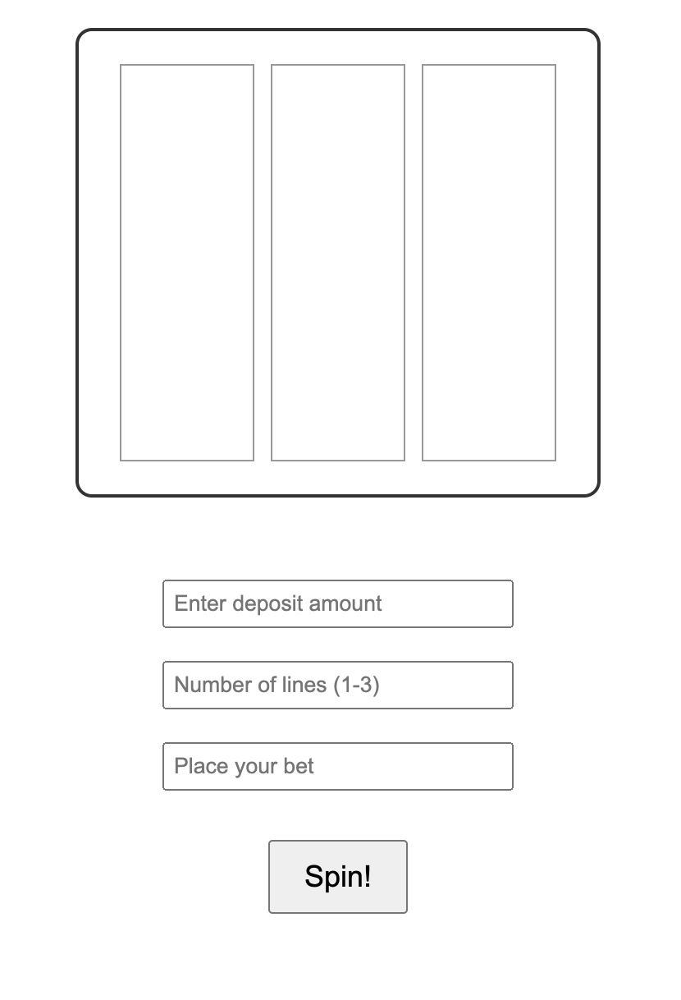
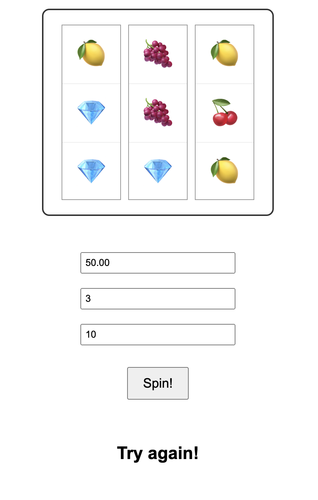

# Slot Machine

- **`slot_machine.js`** is completed from a Youtube tutorial
- **`script.js`** is my adaptation from the previous version so that it can be presented on a webpage
- oh and it also spins.

  
  

